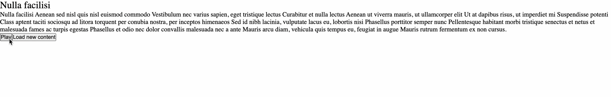

# Speechify Functional Test

## The Setup

#### API

- The code for the api is in the `api` directory. This piece is basically responsible for sending a random response from the array defined in `data.js`.
- The api returns a response in form of a JSON object containing contents. The content string is in form of a subset of SSML that is defined later here.

#### APP

- The project is a basic react app, and such should come with all of the standard built ins of react.
- Core logic for the project is hosted in `lib` folder.
- `content.ts` file in the lib folder is responsible for fetching and parsing content into sentences.
- `speech.ts` file contains an implementation for speech engine using the local window.speechSynthesis API.
- `useSpeech.ts` reactifies the speech engine implementation and returns the controls for playback and gives information about the currently spoken word and sentence.

# For Candidates:

## Goal

- Create an app that calls an api to fetch SSML content and then synthesizes this content into speech and renders a sentence and word UI for the same.

### Implementation Checklist:
- [ ] fetchContent: Fetch content from the API end point using a GET request.
- [ ] parseContentIntoSentences: Parse the fetched content into sentences based on rules described above (please refrain from using DOMParser or any built-in libraries to parse the fetched content)
- [ ] useSpeech: Hook that takes the current set of sentences and plays it using the speechEngine in speech.ts
- [ ] UI: A Controls component that allows you to play, pause and fetch new content. A Currently Reading component that displays the currently read sentence and word.

### SSML

- The API returns the content in form of an SSML string. This string will only contain a subset of SSML features: `<speak>`, `<p>`, `<s>`.
- The assignment only requires focus on the `<s>`element which defines the beginning and the end of the sentences.
- To complete this assignment, you must extract all the sentences from the SSML files ignoring everything else that is invalid.

#### Parsing the SSML.

- Your parser implementation should have the same output as below.

```ts
/**
 * input: "<speak><s>This is a sentence.</s><s>This is another sentence</s></speak>",
 * sentences: ['This is a sentence.', 'This is another sentence']
 *
 * input: <speak><s>This is a sentence.</s><s>This is another sentence</s>Some more text</speak>
 * sentences: ['This is a sentence.', 'This is another sentence']
 *
 * input: <speak><s>This is a sentence.</s><s>This is another sentence</s>Some more text<s>This is a longer piece of content</s></speak>
 * sentences: ['This is a sentence.', 'This is another sentence', 'This is a longer piece of content']
 */
```

### An example of a working project.

